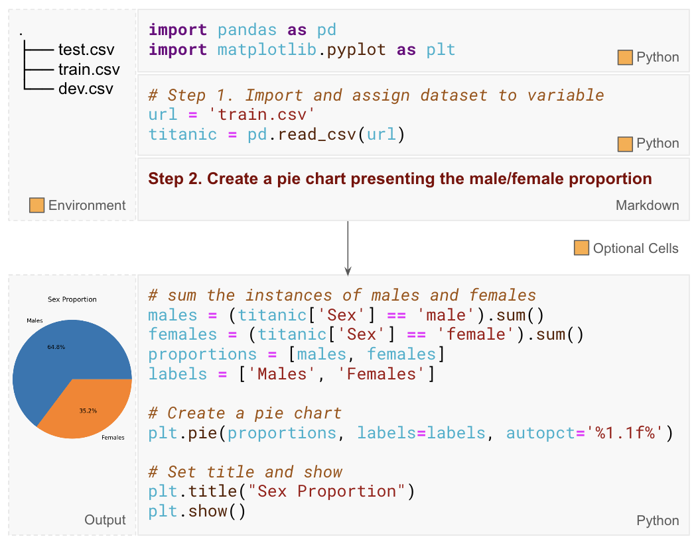

# Text-to-Vis

    

Text-to-Vis refers to the task of taking a human language request for visualisation, data files (optional), and code context (optional), then generating code to produce the corresponding visualisation, as described in Figure above.

## Datasets

#### Plot Coder [(Chen et al., 2021)](https://aclanthology.org/2021.acl-long.169/)
- How it was created: 
    1. Select notebooks from the Juice dataset on GitHub that contain visualization code (e.g., matplotlib, pandas, seaborn).
    2. Identify lines of code that invoke plotting functions (e.g., plt.plot(), sns.barplot()).
    3. Use the plotting code line as the output, and treat the preceding lines as input (including code context and any natural language requests found in the notebook).
- Input: Python Code Context, Natural Language Request
- Output: Python code
- Dataset statistics:
    - Train/Validation/Test Split: 38971/884/942
    - Total utterances: N/A
    - Plotting data: N/A
    - Visualisations created: N/A
- How to evaluate:
    - Chart type accuracy: use the same plotting function?
    - Exact match of data fields
- Website: https://github.com/jungyhuk/plotcoder
- Advantages: Provides a large collection of real-world text-to-vis examples from public notebooks.
- Limitations: Licensing of GitHub notebooks is unclear, and the dataset may overlap with data used to train large language models.

#### NLV Corpus [(Srinivasan et al., 2021)](https://dl.acm.org/doi/10.1145/3411764.3445400)
- How it was created: 
    1. Choose 3 CSV datasets: Cars, Movies, Superstore
    2. Manually create 10 different charts for each dataset using [Vega-lite](https://vega.github.io/vega-lite/) specifications.
    3. Conduct a survey on multiple social media platforms (e.g. LinkedIn and Reddit). Show participants data table and the chart, then ask them to provide utterances they would pose to generate the displayed charts.
    4. Collect, analyze, and organize the responses
- Dataset statistics:
    - Train/Validation/Test Split: No
    - Total utterances: 893
    - Plotting data: 3 CSV files (Cars, Movies, Superstore)
    - Visualisations created: 30
- Input: Natural Language Request (NL request), CSV file
- Output: Vega-lite JSON specification
- How to evaluate:
    - Chart type accuracy: Classify NL request --> Chart type
    - Exact match of Vega-lite components
- Website: https://nlvcorpus.github.io/
- Advantages: 100% manually created
- Limitations: small, no diversity in chart types and plotting data.

#### ChartDialogs
#### nvBench

## Evaluation